# "Data-Driven Tactics: Analyzing Spain's Playing Style in Euro 2024 Qualifiers"

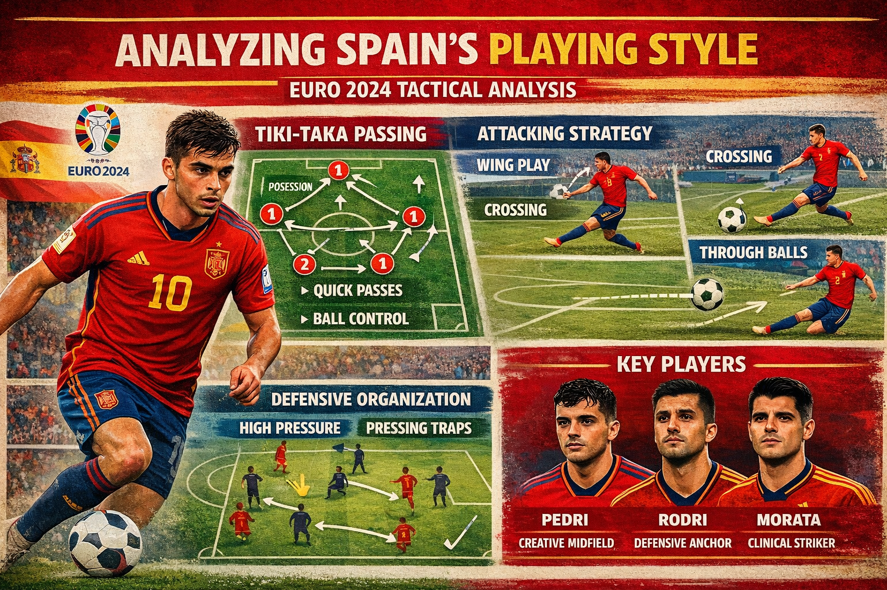

## Introduction

Modern football analytics has transformed how we understand team tactics and playing styles. By leveraging detailed match event and tracking data, we can quantify patterns that were previously only observable through subjective analysis. This post examines Spain's playing dynamics during the Euro 2024 qualifiers, combining Wyscout event data with Skillcorner tracking data to provide a multi-faceted tactical analysis. **Note that the underlying data is highly confidential and therefore not included in this repository.**

Spain's national team has long been synonymous with possession-based football and their distinctive 'Tiki-Taka' style—characterized by short passing sequences, high technical skill, and positional fluidity. However, this approach comes with inherent tactical trade-offs. Through systematic data analysis, we can identify not only the strengths of this philosophy but also potential weaknesses that opposition teams might exploit.

### Offside Patterns

Based on our viewing experience we expected that Spain would have a relatively high number of offsides compared to other teams. A first glance at the data later confirmed that Spain was indeed among the teams with the most offsides in the Euro 2024 qualifiers. This is also displayed in the table below which is based on all Wyscout data of all matches after removing all of the non-European teams. Interestingly, Albania is also among the top ten teams with the highest number of offsides per game.

One player particularly caught our eye: Álvaro Morata who was caught offside eight times across his six game appearances. However, as nominal data can be misleading in football, we decided to additionally have a look at the normalized offside calls per player. In the below plot we can see that albeit Álvaro Morata being flagged offside more frequently than his teammates he is not the player with the highest offside rate due to his high playing time (461 played minutes). Instead, the first place goes to Ansu Fati who, despite being caught offside only once, had the highest offside rate due to only playing for 45 minutes.

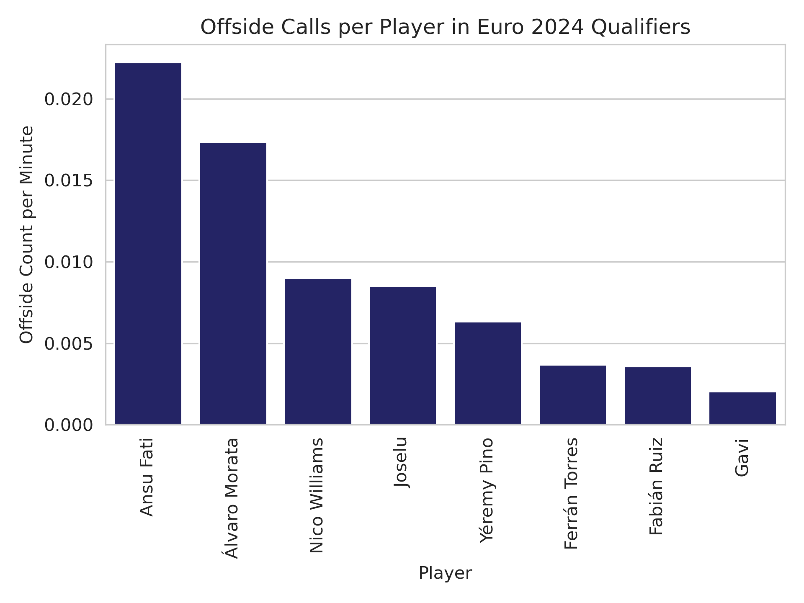

Moreover, most of the offsides by the Spanish team occured after a forward pass attempt (most frequently by Dani Carvajal) into the final third of the pitch. 

### Passing Patterns and Accuracy

Additionally, we investigated the relationship between passing accuracy and number of passes when normalizing the number of passes by the minutes played in the left plot below.
It is apparent that center backs tend to have the highest number of passes and the highest accuracy whilst forwards usually have the lowest passing completion rate with few passes per minute. This is in line with the typical Spanish "Tiki-Taka" playstyle where risky passes are often avoided and instead the ball is circulated around the pitch frequently involving defenders in the build up. Moreover, when stratifying the accuracy by whether or not the player was under pressure at the time of the pass, we observe that the accuracy of the passes under pressure tends to be lower than the passes without pressure. This is displayed in the right plot below where the forwards again are in the bottom left corner and the center back in the top right corner. Our explanation for this is that the forwards often will be pressured by multiple defenders yielding a much lower accuracy when under pressure compared to under no pressure. Interestingly, the pass completion percentage of the Goalkeeper Unai Simón is much lower when under pressure probably because he just clears the ball away whenever under pressure. Finally, be aware that contains only relatively few passes under pressure and thus we had to restrict ourselves to players with a minimum of 135 minutes (equivalent to 1.5 full games) played to not overcrowd the plot with players that have made no or only few passes under pressure.

<table>
<tr>
<td width="50%">
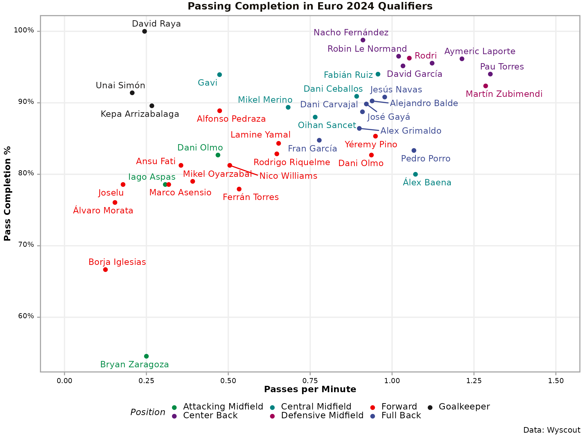
</td>
<td width="50%">
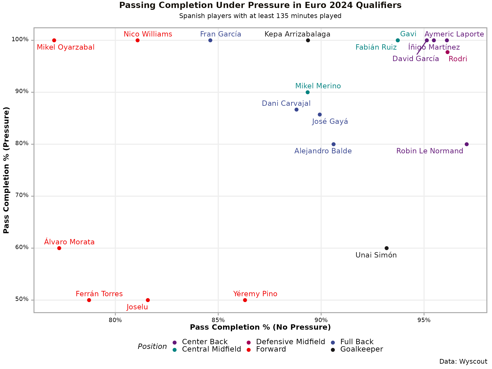
</td>
</tr>
</table>

This "false nine" role is further emphasized in the passing sonars below with the central forward only involved in few passes. Judging from the color fill of the sonars it appears that apart from the goalkeeper and the central midfielders, the players generally tend to avoid long passes. Again, we can see that forwards often pass backwards to keep possession, while the defenders often pass the ball back and forth to each other, and the central midfielders distribute it and play out wide. These patterns demonstrate that the Spanish team remains faithful to their beloved "Tiki-Taka" style of play.

<table>
<tr>
<td width="50%">
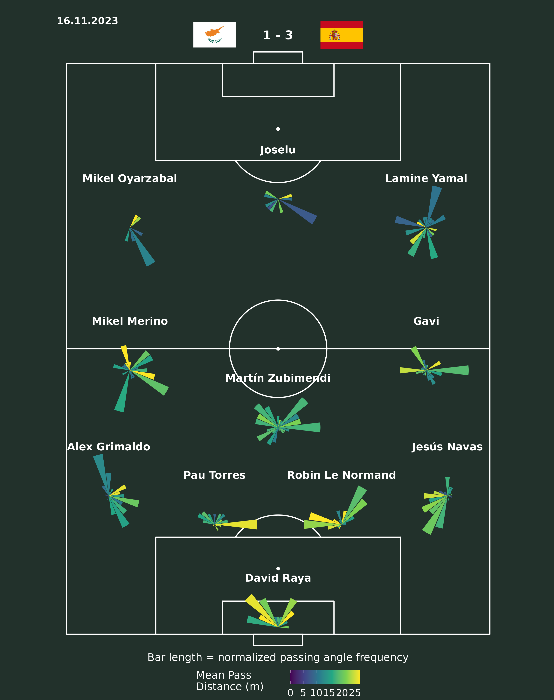
</td>
<td width="50%">
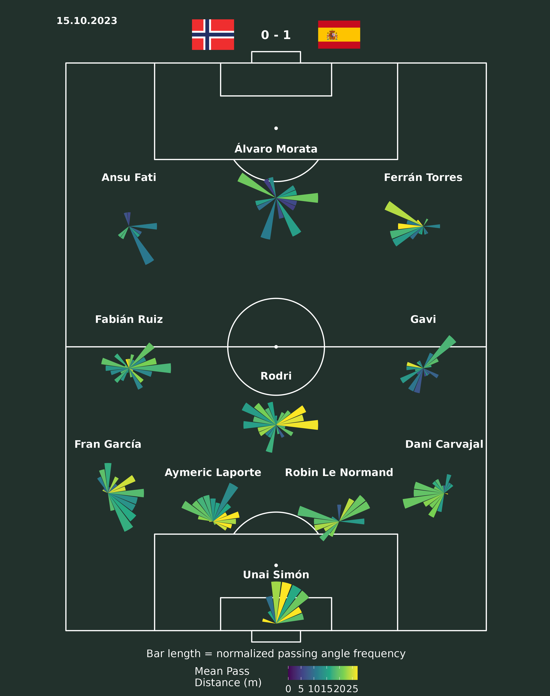
</td>
</tr>
<tr>
<td width="50%">
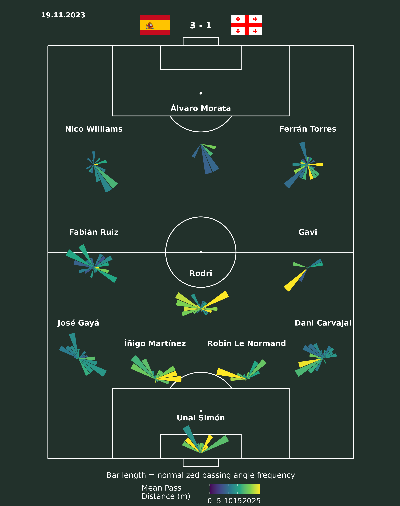
</td>
<td width="50%">
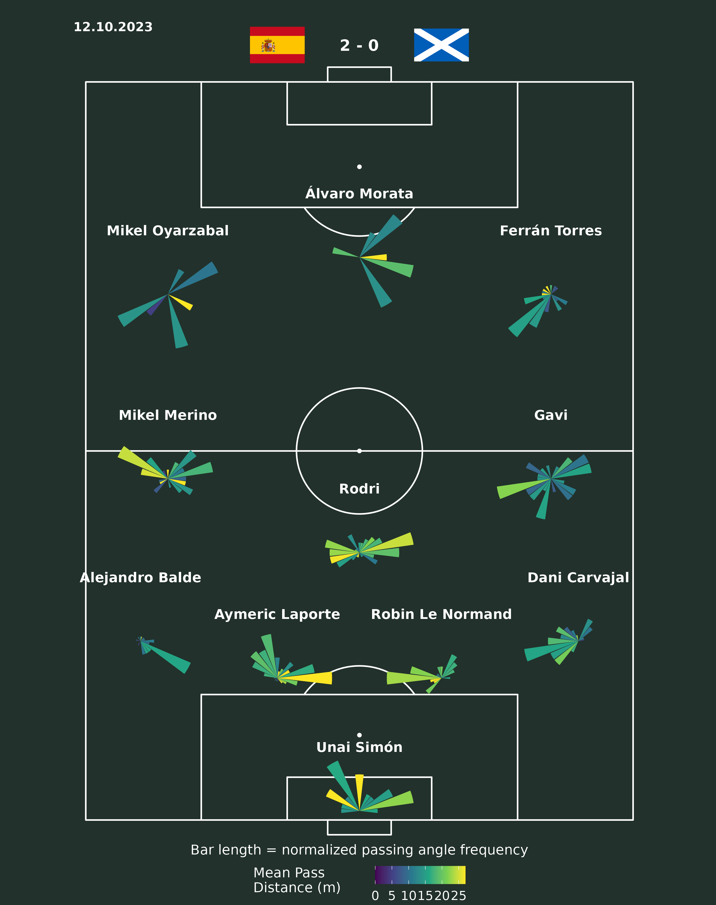
</td>
</tr>
</table>

## Set Piece Analysis

In the following subsections, we will examine different set pieces, how they are executed by the Spanish team and how they change the game dynamics and outcomes.

### Throw-ins

The plots below show the throw-in sonars (left) and trajectories (right) for the Spanish team across all eight qualifying matches and are based on `Wyscout` data. The throw-in sonars show the angle of the throw-ins, with the length of the sonar indicating the frequency of throw-ins in that direction and the color specifying the length of the throw-in in meters. The plot on the right shows the trajectory from the beginning to the end location of the throw-ins colored by whether the throw-in was accurate or not. In the plot on the right, Spain attacks from the bottom to the top of the plot.

<table>
<tr>
<td width="50%">
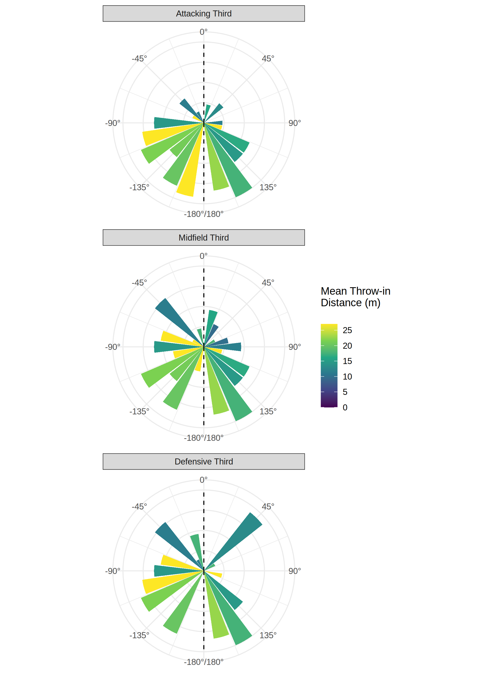
</td>
<td width="50%">
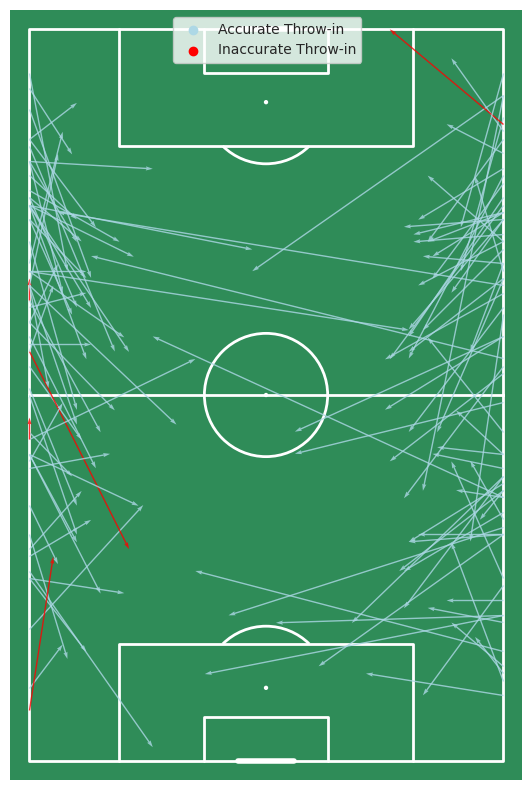
</td>
</tr>
</table>

It is apparent from the throw-in trajectories on the right that most of the throw-ins for the Spanish team take place in the middle and attacking thirds of the pitch. Moreover, there does not appear to be a systematic relationship between throw-in accuracy and the different thirds. In general, there are only few inaccurate throw-ins despite the average throw-in distance being almost 20 meters. This can be explained by the throw-in sonars from which it is evident that most of the throw-ins and directed backwards, especially in the attacking third. Thus, the Spanish team does not rely on throw-ins to create scoring opportunities in the attacking third but instead utilize them to maintain possession and stabilize their play.

### Corners

The plot below shows the corner kick trajectories for the Spanish team colored by accuracy, where a corner is considered accurate if a Spanish player successfully receives the ball. Overall, Spain's corner accuracy is striking, especially for deliveries going directly into the box. We can also see that many corners are played short and backwards, likely to retain possession and create a better crossing angle.

Interestingly, there is a notable asymmetry between the two sides: corners from the left side are overwhelmingly accurate, even when delivered into the middle of the box. In contrast, corners from the right side that target the area close to the goal are frequently inaccurate, suggesting that the in-swinging deliveries from the left are more effective than the out-swinging ones from the right for Spain's set-piece setup.

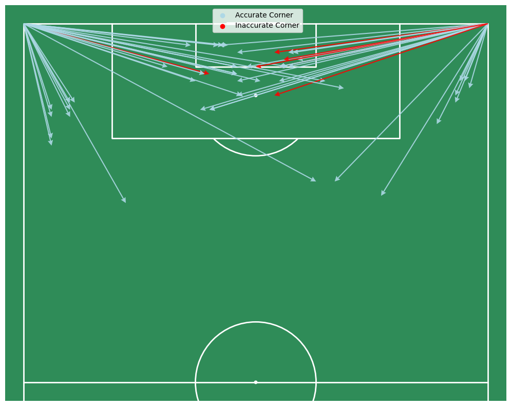

## Formation and Positioning Analysis

### Formation Convex Hulls

The plots below show the formation at two random time points during the first half and two random time points in the second half for all games for which we have `Skillcorner` data. As in Shaw and Glickman (2019), the shaded regions indicate the convex hull of the players with the blue arrow pointing to the center of mass of this convex hull. This allows us to compare the relative positioning of the Spanish players across randomly selected time points stratified by possession type. The distinction between in possession and out of possession is made only when the team has been in or out of possession for at least 10 seconds, ensuring that only stable formations are included in the analysis. Finally, Spain attacks from the bottom to the top in all of the plots.

<table>
<tr>
<td colspan="2" align="center">
<strong>In Possession</strong>
</td>
</tr>
<tr>
<td width="50%">

</td>
<td width="50%">

</td>
</tr>
<tr>
<td width="50%">

</td>
<td width="50%">

</td>
</tr>
<tr>
<td colspan="2" align="center">
<strong>Out of Possession</strong>
</td>
</tr>
<tr>
<td width="50%">

</td>
<td width="50%">

</td>
</tr>
<tr>
<td width="50%">

</td>
<td width="50%">

</td>
</tr>
</table>

It is evident, that whenever Spain is in possession, the team tries utilizing the full width of the pitch. This creates space and ensures that there are always passing options available for Spains infamous short passing game. Formation-wise, the 4-3-3 formation of Spain tends to persist whenever Spain is in possession. The midfielders often form a triangle to provide multiple passing options. This structure is crucial for maintaining possession and slowly advancing the ball up the pitch. In contrast, when Spain is out of possession, the team tends to adopt a more narrow and compact formation. The formation still resembles a 4-3-3, but the midfielder drop back which leads to the players being closer  together. This limits the space available for the opposition allows Spain to press more effectively in the midfield. Additionally, this compact formation often forces the opposition to play on the sides of the pitch instead of through the densely-populated middle.

### Defensive Line Positioning

The heatmaps below display Spain's defensive line positioning both in possession and out of possession across all matches for which we have access to `Skillcorner` data. .Note that contrary to above formation plots, these heatmaps include all data points for completeness i.e. there is no minimum amount of time in/ out of possession required. Again, Spain attacks from the bottom to the top in all of the plots.

<table>
<tr>
<td colspan="2" align="center">
<strong>In Possession</strong>
</td>
</tr>
<tr>
<td width="50%">

</td>
<td width="50%">

</td>
</tr>
<tr>
<td width="50%">

</td>
<td width="50%">

</td>
</tr>
<tr>
<td colspan="2" align="center">
<strong>Out of Possession</strong>
</td>
</tr>
<tr>
<td width="50%">

</td>
<td width="50%">

</td>
</tr>
<tr>
<td width="50%">

</td>
<td width="50%">

</td>
</tr>
</table>

The heatmaps show that the defensive line tends to be slightly more offensive when in possession but the difference between in and out of possession is not striking. In general, the defensive line is always relatively high up the pitch, with the most frequent positions being right in front of the middle line. This is in line with Spain's controlling play style when in possession and high pressing when out of possession. Additionally, the defensive line tends to be higher when playing against weaker teams. 

Moreover, both wing backs tend to be positioned further forward than the center backs, as is typical in the 4-3-3 formation that Spain loves to run. This allows the wing backs to provide width and support when attacking whilst the more defensively positioned center-backs provide stability and try to always be available for a back pass when the team is under pressure or wants stabilize the game.

## Tactical Recommendations for Opposition Teams

Based on our comprehensive analysis of Spain's playing style, we can identify several tactical vulnerabilities that opposition teams might exploit:

### Exploiting the Offside Trap

As was detailed in the offside analysis section, Spanish players frequently get caught offside. Hence, Albania should maintain a well-organized defensive line that moves up as a unit to catch Spanish players offside. Particularly, Albania could try to exploit the fact that Carvajal's through ball attempts to Álvaro Morata often result in offside positions by tracking Morata and stepping up as a unit when Carvajal is about to play the ball, effectively creating an offside trap. The resulting free-kick could then be used to quickly launch a counter-attack exploiting Spain's high positioning.

### Pressing the Forwards

The passing analysis showed us that the forwards are particularly susceptible to making inaccurate passes when under pressure. Moreover, we observed that in Spain's game development style, the strikers often drop back to receive the ball and then distribute it back to the midfield or to the flanks. This suggests pressuring the forwards whenever possible, without compromising our own defensive line too much, to provoke inaccurate passes. Albania could implement this by having one of the center backs remain as attentive as possible while maintaining close one-to-one marking of the central forward.

### Exploiting the High Defensive Line

As seen in our defensive line analysis, Spain employs a high defensive line as a consequence of their possession-based playstyle, which renders them vulnerable to quick counter-attacks. Hence, Albania should occasionally try to exploit this high defensive line by attempting long balls behind the Spanish defense, even if this might cost Albania possession more often than not.